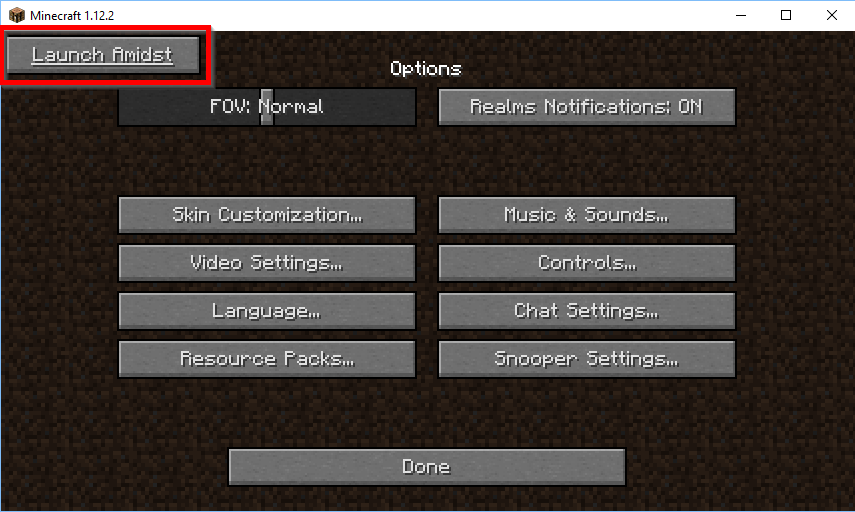

Amidst for Forge
================

Client-Side only mod that integrates all modded biomes into the [Amidst application](https://github.com/toolbox4minecraft/amidst). 

How to use
----------

This mod adds two ways of starting amidst: 
* A button in the options menu 
  
* the command `/amidst`

Start Amidst using one of these methods.

> Note: Some mods (e.g. Traverse) only add their biomes during server start. If you encounter differences between amidst output and the minecraft world try to start a single player world with corresponding settings first. This is especially relevant with mods that add versioned biomes.

Known issues
------------

Some functions of the launched Amidst application such as "Switch profile" and "Open saved game" do not work and cause exceptions. For further issues please check the [issue tracker](../../issues)